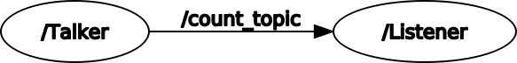
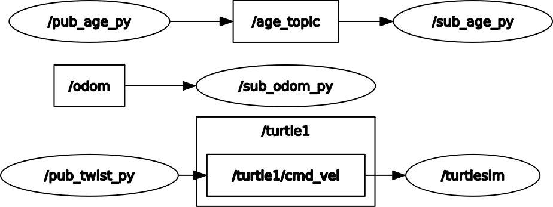
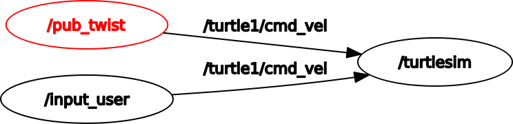
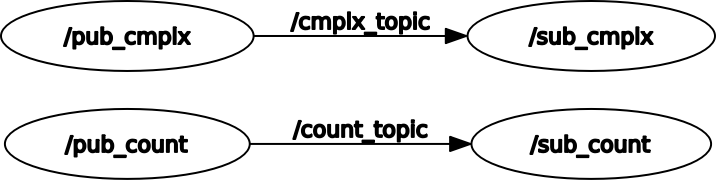
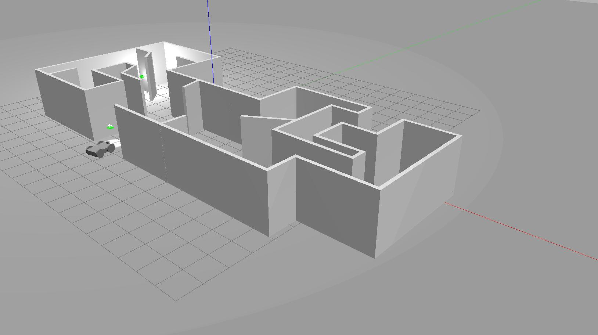
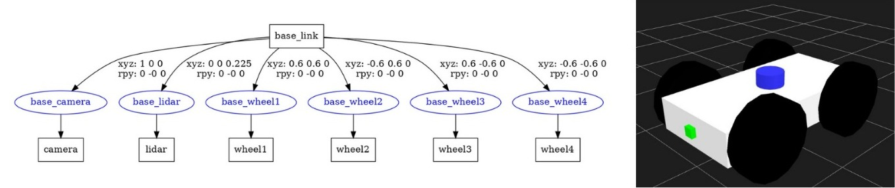
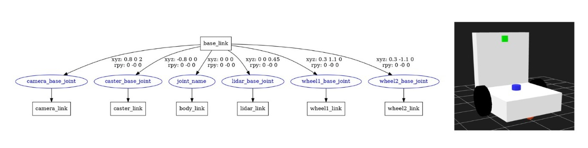

# Autonomous Robotics Course
## Instructor: [Eng.Khaled Gabr](https://github.com/khaledgabr77)

  
click to show course content

  
    ### Course Content
  
    - Introduction to Linux, Terminal, and Shell
    - Python Programming
    - C++ Programming
    - Introduction to ROS and ROS installation
    - ROS Core Concepts:
      - Master
      - Nodes
      - Topics
      - Messages
      - Services
    - ROS Labs (rostopic, rosmsg, rosnode, rosservice)
    - Creating a ROS WorkSpace and Packages
    - Writing a ROS Publisher and Subscriber
    - Writing a ROS Service and Client
    - Creating a Custom ROS Message
    - ROS Tools:
      - Launch files
      - ROS Bag
      - RQT
      - Remap
    - Gazebo, RVIZ: creating a custom robot using Gazebo
    - Creating a custom robot using URDF
    - Adding Gazebo plugins with ROS
    - Kinematics with ROS
    - Turtlebot3 Lab
    - ROS project
    - TF ROS
    - 2D and 3D Frames
    - Transformations
    - Localization:
      - Kalman Filter
      - MCL
      - AMCL Package
    - SLAM
    - Navigation

## ROS Tasks

> Note: All nodes written in C++ and Python also.

### Task 1
* [count_ws](Task_1/count_ws)
  * publisher and subscriber to start count from 100 until the user uses CTRL C.
  * 
* [nomeer_ws](Task_1/nomeer_ws)
  * publisher and subscriber using String msg("I am Learning Robotics and ROS") until the user uses CTRL C.
  * 
  
---
### Task 2
* [nomeer_robot_ws](Task_2/nomeer_robot_ws)
  * move_pkg with robot_py.launch file.
  * publish data to the /cmd_vel topic.
  * Modify the code in order to print the odometry of the robot.
  * Python file that creates a publisher that indicates the age of the robot
  
    

---
### Task 3
* [control_nomeer_roboot_ws](Task_3/control_nomeer_roboot_ws)
  * Users can input a linear (x) velocity in the range [2,6] (floating point allowed)
  * Users can input an angular (z) velocity [2,6] (floating point allowed)
  * another node to publish data to the /cmd_vel topic
  
  

---
### Task 4
* [nomeer_ws](Task_4/nomeer_ws)
  * publisher and subscriber to count from 0 until the user uses CTRL C.
  * message nodes that publish Complex(real, imaginary) numbers.
  * a service that can count the number of words, ex: i love you >> 3, you are the best >> 4. 

  
  
---
### Task 5
* [gazebo](Task_5/src)
  * first gazebo task
  * create Model(Robot) & Environment
  * Adding the Environment + Model  inside a World
  
  
  
---
### Task 6
* [URDF](Task_6/src/nomeer_xacro_pkg/urdf/)
  * [Tasks 6.1:](/4.ROS/Tasks/Task_6/src/nomeer_xacro_pkg/urdf/Robot_1/nomeer1_robot.xacro)
    - Create custom robot using URDF/XACRO the robot should have:
      - 4 driver wheels 
      - Normal Camera, the camera should be in front of robot.
      - Lidar should be at the center of robot.
      
        
        ---
  * [Tasks 6.2:](Task_7/src/robot_description/urdf/robot.xacro)
    - Create custom robot using URDF/XACRO the robot should have:
      - 4 driver wheels OR 2 driver wheels and 1 driven free wheel(Castor wheel)
      - Normal Camera, the camera should be in front of robot.
      - the robot should have a tour at least 1m height attached with last edge of robot.
      - 1 Depth Camera(Xbox camera, RealSense Camera,..), the camera should be attached to the tour and at least at height 1m of robot.
      - Lidar should be at the center of robot.
      
        
        
---
### Task 7
* [Gazebo Plugin](/4.ROS/Tasks/Task_7/src)
  * Add Gazebo Plugin (lidar, camera, diff) for [Task 6.2](Task_7/src/robot_description/urdf/robot.xacro) Robot. ([gazebo.xacro](4.ROS/Tasks/Task_7/src/robot_description/urdf/gazebo.xacro))
  * download .stl or .dae file for the lidar and added to mesh folder also added to your URDF
  * create your world in gazebo
  * launching the robot in your world ([robot.launch](Task_7/src/robot_gazebo/launch/robot.launch))
